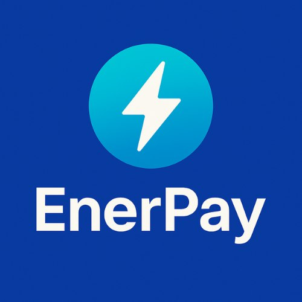

# ⚡️ EnerPay

[](https://enerpay.vercel.app/)
[](LICENSE)
[](https://react.dev/)
[](https://rainbowkit.com/)

> Plataforma de pagos de CFE con MXNB, simple, rápida y descentralizada.

---

## 🚀 ¿Qué es EnerPay?

**EnerPay** es una plataforma web que permite pagar tu recibo de CFE utilizando la stablecoin MXNB, integrando tecnología blockchain y una experiencia de usuario sencilla y segura. Conecta tu wallet, paga y olvídate de complicaciones.

- 🌐 Proyecto participante en el **Hackathon de Bitso 2025**
- 🔌 Integración con la API de **JUNO** para procesamiento de pagos

---

## ✨ Características

- 🔗 **Conexión de Wallets**: Soporte para MetaMask, WalletConnect y más vía RainbowKit.
- 💸 **Pagos con MXNB**: Realiza pagos de CFE usando la stablecoin mexicana.
- 📊 **Dashboard**: Visualiza tu historial de pagos y estadísticas.
- 📚 **Aprende**: Sección educativa sobre blockchain, MXNB y pagos descentralizados.
- 🏢 **Empresas**: Soluciones para negocios y partners.
- 🌙 **UI Moderna**: Interfaz atractiva, responsiva y fácil de usar.

---

## 🖥️ Demo

¡Prueba la app en vivo!  
[🔗 enerpay.vercel.app](https://enerpay.vercel.app/)

---

## 📸 Screenshots

<!-- Puedes agregar imágenes aquí -->
<p align="center">
  
</p>

---

## ⚙️ Instalación y uso

```bash
# 1. Clona el repositorio
git clone https://github.com/Descentralizadox/enerpay.git
cd enerpay

# 2. Instala dependencias
npm install

# 3. Inicia el frontend
npm run dev

# 4. Inicia el backend (opcional)
cd backend
npm install
node index.js
```

---

## 🛠️ Tecnologías

- React + TypeScript
- TailwindCSS
- RainbowKit + Wagmi (Web3)
- Solidity (Smart Contracts)
- Node.js (Backend)
- JUNO API (Pagos)
- Vercel (Deploy)

---

## 🤝 Contribuir

¡Las contribuciones son bienvenidas!  
1. Haz un fork del repo  
2. Crea una rama (`git checkout -b feature/nueva-feature`)  
3. Haz commit de tus cambios  
4. Abre un Pull Request

---

## 📄 Licencia

MIT © 2024 EnerPay

---

## 💬 Contacto

¿Dudas, sugerencias o quieres colaborar?  
Escríbenos a [info@enerpay.mx](mailto:info@enerpay.mx) o únete a nuestro [Telegram](https://t.me/enerpay).

---

<p align="center">
  <b>EnerPay - Pagos de luz, ahora descentralizados ⚡️</b>
</p>
